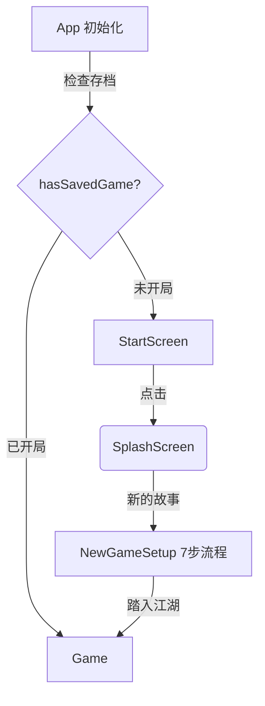
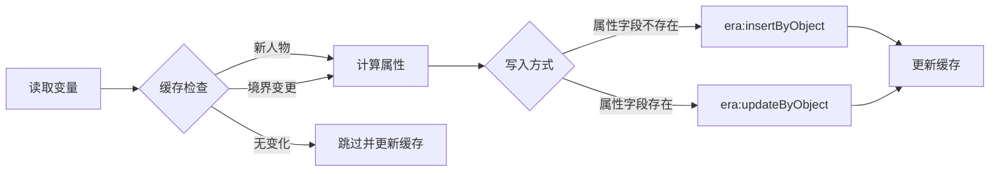
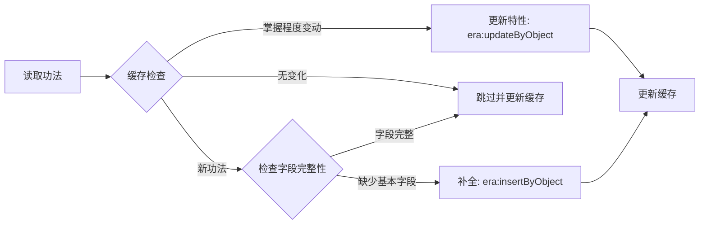
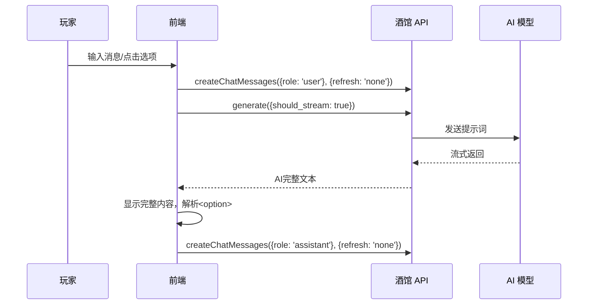
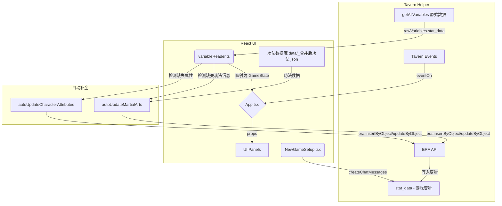
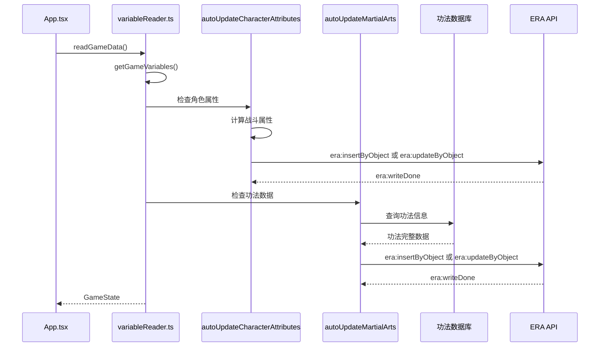

# 墨剑录 (Ink & Blade) 项目架构文档

## 1. 项目概述

**墨剑录** 是一个基于酒馆助手的沉浸式武侠RPG前端界面，通过读取和生成聊天消息中的变量来驱动游戏状态。本项目利用 React 构建，与酒馆助手的原生功能深度集成。

---

## 2. 文件结构

```
src/武侠/
├── App.tsx              # 核心应用组件，管理页面流程和主布局
├── index.html           # 前端界面HTML入口
├── index.tsx            # React应用挂载点
├── types.ts             # TypeScript类型定义
├── components/          # UI组件目录
│   ├── ChatInput.tsx      # 聊天输入组件
│   ├── FullscreenButton.tsx # 全屏切换按钮
│   ├── GameContent.tsx    # 游戏内容显示（正文+选项）
│   ├── Icons.tsx          # 图标组件
│   ├── Modal.tsx          # 通用模态框
│   ├── NewGameSetup.tsx   # 开局设置界面（7步流程）
│   ├── SettingsPanel.tsx  # 设置面板
│   ├── SplashScreen.tsx   # 标题/选择界面
│   ├── StartScreen.tsx    # 启动界面
│   ├── StatusToast.tsx    # 状态提示组件
│   └── panels/            # 游戏面板组件（从 GamePanels.tsx 拆分）
│       ├── index.ts           # 统一导出
│       ├── EmptyState.tsx     # 共用空状态组件
│       ├── CharacterPanel.tsx # 角色面板（含 StatBar、Attribute）
│       ├── MartialArtsPanel.tsx # 功法面板
│       ├── InventoryPanel.tsx # 背包面板
│       ├── EventsPanel.tsx    # 事件面板
│       ├── SocialPanel.tsx    # 社交面板
│       └── MapPanel.tsx       # 地图面板
├── hooks/               # 自定义 Hooks（从 App.tsx 提取）
│   ├── index.ts             # 统一导出
│   ├── useDebugLogs.ts      # 调试日志管理
│   ├── useToast.ts          # Toast 提示管理
│   ├── usePageFlow.ts       # 页面流程状态
│   ├── useGameState.ts      # 游戏状态管理
│   ├── useEventListeners.ts # 事件监听逻辑
│   └── useMessageHandler.ts # 消息发送处理
├── data/                # 静态数据文件目录
│   ├── _合并后功法.json    # 功法数据库
│   ├── 事件信息汇总.json   # 预设事件数据（事件名+触发时间）
│   ├── 天资等级.json       # 天资等级配置（凡人/良才/天才/绝世）
│   ├── 属性点数消耗表.json # 属性点和福缘点数消耗规则
│   ├── 外貌描述模板.json   # 按性别和风姿值分类的外貌描述模板
│   ├── 境界系统.json       # 境界等级列表和境界-修为映射
│   ├── 武功选项.json       # 初始武功选项（太祖长拳、罗汉拳等）
│   ├── 出身选项.json       # 所有出身选项（江湖门派/世家豪门/平民百姓/特殊身份）
│   └── 开场白.json         # 开场白字符串数组
├── styles/              # 样式目录 (模块化 SCSS)
│   ├── main.scss          # 主入口
│   ├── variables.scss     # SCSS 变量
│   ├── _reset.scss        # 样式重置
│   ├── _layout.scss       # 布局样式
│   ├── _header.scss       # 头部样式
│   ├── _navigation.scss   # 导航样式
│   ├── _panels.scss       # 面板样式
│   ├── _chat.scss         # 聊天样式
│   ├── _modal.scss        # 模态框样式
│   ├── _screens.scss      # 屏幕样式
│   ├── _settings.scss     # 设置样式
│   ├── _events.scss       # 事件样式
│   ├── _toast.scss        # Toast 样式
│   └── setup/             # 开局设置样式（从 _setup.scss 拆分）
│       ├── _index.scss        # 入口文件
│       ├── _base.scss         # 主容器、背景层
│       ├── _steps-indicator.scss # 步骤指示器
│       ├── _forms.scss        # 表单通用样式
│       ├── _components.scss   # 通用组件样式
│       ├── _step-talent.scss  # 天资选择
│       ├── _step-attributes.scss # 属性分配
│       ├── _step-traits.scss  # 天赋选择
│       ├── _step-martial.scss # 武功选择
│       ├── _step-origin.scss  # 出身选择
│       ├── _step-identity.scss # 身份设置
│       ├── _step-confirm.scss # 确认保存
│       └── _gacha.scss        # 抽卡系统
└── utils/               # 工具函数目录
    ├── logger.ts              # 分类日志工具（生产环境自动禁用）
    ├── gameInitializer.ts     # 游戏初始化
    ├── martialArtsDatabase.ts # 功法数据库
    ├── realmSystem.ts         # 境界升级系统
    ├── settingsManager.ts     # 显示设置管理
    ├── useFullscreen.ts       # 全屏功能Hook
    ├── variableReader.ts      # 酒馆变量读取
    ├── attributeCalculator.ts # 属性计算
    └── traitsDatabase.ts      # 天赋数据库
```

---

## 3. 核心概念与实现

### 3.1. 页面流程



**开局检测逻辑**: 检查是否存在 assistant 消息 + user数据特征字段（性别/境界/用户名）

**7步角色创建流程**:

1. 天资选择（决定总点数30/40/55/70）
2. 七维属性分配
3. 天赋选择（含抽卡系统）
4. 武功选择（含抽卡系统）
5. 出身选择
6. 身份设置
7. 确认保存

### 3.2. 状态管理

游戏状态与酒馆聊天记录绑定，实现"存档于楼层"：

- **数据读取**: 使用 `getAllVariables()` API 获取合并后的变量表
- **重要**: 游戏变量存储在 `stat_data` 键下，user数据在 `stat_data.user数据`
- **数据监听**: 通过 `eventOn` 监听 `MESSAGE_RECEIVED` 和 `CHAT_CHANGED` 事件
- **自动补全**: 前端在读取变量时会自动检测并补全缺失的属性和功法信息

### 3.2.1. 前端变量自动补全机制

前端在 `readGameData()` 读取变量时，会自动检测并补全/更新以下数据。

**重要**: 为避免每次消息都触发不必要的更新，系统使用**缓存机制**来检测状态变化，只有当检测到实际变化时才执行更新。

#### 缓存机制

系统维护两个内存缓存来跟踪状态：

| 缓存                   | 键格式                        | 存储内容             | 用途                     |
| ---------------------- | ----------------------------- | -------------------- | ------------------------ |
| `characterStateCache`  | `"玩家"` 或 `"角色:{角色名}"` | 境界、是否存在       | 检测新人物或境界变更     |
| `martialArtStateCache` | `"{拥有者}:{功法名}"`         | 掌握程度、是否已补全 | 检测新功法或掌握程度变动 |

#### 角色属性自动计算 (`autoUpdateCharacterAttributes`)

**触发条件**（基于缓存检测）：

1. **新人物出现** - 缓存中不存在该角色
2. **境界变更** - 缓存中的境界与当前不同



**属性计算公式**: 根据初始属性 + 境界 + 功法加成，计算战斗属性（臂力、根骨、机敏、洞察）和资源属性（气血、内力）

**气血/内力格式**: `"当前值/最大值"` 字符串格式（如 `"800/1000"`）

#### 功法自动补全 (`autoUpdateMartialArts`)

**触发条件**（基于缓存检测）：

1. **新增功法** - 缓存中不存在该功法
2. **掌握程度变动** - 缓存中的掌握程度与当前不同（需要解锁新特性）

AI 生成的功法数据通常只包含功法名和掌握程度，前端根据功法数据库 `data/_合并后功法.json` 自动补全完整信息：



| 场景         | 触发条件                    | 处理方式               | ERA API              |
| ------------ | --------------------------- | ---------------------- | -------------------- |
| **补全**     | 新功法 + 缺少类型/描述/品阶 | 添加不存在的字段       | `era:insertByObject` |
| **更新特性** | 掌握程度变动                | 根据新掌握程度解锁特性 | `era:updateByObject` |
| **跳过**     | 无变化（缓存命中）          | 不执行任何写入         | -                    |

**补全后的功法结构**:

```yaml
功法名:
  类型: "内功/外功/轻功/剑法等"
  功法描述: "功法的详细描述..."
  功法品阶: "粗浅/传家/上乘/镇派/绝世/传说"
  掌握程度: "初窥门径"  # 保留AI生成的值
  特性:
    初窥门径: "特性描述..."  # 只包含已解锁的特性
```

#### 防重复调用保护

为避免写入触发的 `era:writeDone` 事件导致无限循环，补全函数使用双重保护机制：

1. **标记位锁**:
   - `isUpdatingCharacterAttributes` - 角色属性更新锁
   - `isUpdatingMartialArts` - 功法补全更新锁

2. **缓存机制**: 即使锁被释放，缓存检查也会阻止对未变化数据的重复更新

### 3.3. 消息发送与接收流程



### 3.4. 内容显示策略

- **直接显示完整内容**: AI回复直接作为正文显示
- **只解析选项**: 仅解析 `<option>` 标签生成可点击按钮
- **用户自定义过滤**: 通过设置面板的正则替换功能过滤内容

### 3.5. 技术栈

| 层级 | 技术                      | 描述             |
| ---- | ------------------------- | ---------------- |
| 框架 | React 19 + TypeScript     | 构建UI           |
| 构建 | Webpack                   | 开发和生产构建   |
| 后端 | 酒馆助手                  | AI交互、变量存储 |
| 样式 | SCSS (模块化)             | 武侠风格UI       |
| 库   | `js-yaml`, `lucide-react` | YAML解析、图标   |

### 3.6. 模块化架构

项目采用模块化设计，将大型文件拆分为职责单一的小模块：

#### 3.6.1. 自定义 Hooks (`hooks/`)

从 `App.tsx` 提取的状态管理逻辑，遵循 React Hooks 最佳实践：

| Hook                | 职责           | 主要状态/功能                                       |
| ------------------- | -------------- | --------------------------------------------------- |
| `useDebugLogs`      | 调试日志管理   | `debugLogs`, `addDebugLog`, `clearDebugLogs`        |
| `useToast`          | Toast 提示管理 | `toastState`, `showToast`, `hideToast`              |
| `usePageFlow`       | 页面流程状态   | `currentPage`, `handleStart`, `handleNewGame`       |
| `useGameState`      | 游戏状态管理   | `gameState`, `readGameData`, `DEFAULT_GAME_STATE`   |
| `useEventListeners` | 事件监听逻辑   | `MESSAGE_RECEIVED`, `CHAT_CHANGED`, `era:writeDone` |
| `useMessageHandler` | 消息发送处理   | `handleSendMessage`, 消息流控制                     |

**使用示例**:

```typescript
import { useDebugLogs, useGameState, usePageFlow } from './hooks';

function App() {
  const { debugLogs, addDebugLog } = useDebugLogs();
  const { gameState, readGameData } = useGameState();
  const { currentPage, handleStart } = usePageFlow();
  // ...
}
```

#### 3.6.2. 面板组件 (`components/panels/`)

从 `GamePanels.tsx` 拆分的独立面板组件：

| 组件               | 行数 | 职责                              |
| ------------------ | ---- | --------------------------------- |
| `EmptyState`       | ~20  | 共用空状态提示                    |
| `CharacterPanel`   | ~280 | 角色信息（含 StatBar、Attribute） |
| `MartialArtsPanel` | ~230 | 功法列表与详情                    |
| `InventoryPanel`   | ~125 | 背包物品管理                      |
| `EventsPanel`      | ~80  | 事件列表                          |
| `SocialPanel`      | ~145 | 社交关系                          |
| `MapPanel`         | ~10  | 地图显示                          |

#### 3.6.3. 分类日志工具 (`utils/logger.ts`)

生产环境自动禁用的分类日志系统：

```typescript
import { initLogger, messageLogger, gameLogger } from './utils/logger';

// 使用分类日志
initLogger.log('🎮 初始化开始...');
messageLogger.log('收到消息:', message);
gameLogger.error('游戏状态错误:', error);
```

**日志类别**:

| 类别      | 前缀 | 用途          |
| --------- | ---- | ------------- |
| `init`    | 🎮    | 初始化流程    |
| `message` | 💬    | 消息处理      |
| `event`   | 📡    | 事件监听      |
| `game`    | 🎯    | 游戏状态      |
| `api`     | 🌐    | API 调用      |
| `ui`      | 🖼️    | UI 组件       |
| `data`    | 📊    | 数据读取/解析 |

**特性**:

- 生产环境 (`NODE_ENV !== 'development'`) 自动禁用所有日志
- 可按类别单独开关（修改 `DEBUG_CATEGORIES`）
- 提供 `logger` 全局日志器用于不需要分类的场景

#### 3.6.4. 样式模块 (`styles/setup/`)

从 `_setup.scss` 拆分的开局设置样式：

```scss
// styles/setup/_index.scss - 入口文件
@import 'base';           // 主容器、背景层
@import 'steps-indicator'; // 步骤指示器
@import 'forms';          // 表单通用样式
@import 'components';     // 通用组件
@import 'step-talent';    // 天资选择
@import 'step-attributes'; // 属性分配
@import 'step-traits';    // 天赋选择
@import 'step-martial';   // 武功选择
@import 'step-origin';    // 出身选择
@import 'step-identity';  // 身份设置
@import 'step-confirm';   // 确认保存
@import 'gacha';          // 抽卡系统
```

---

## 4. 变量结构

### 4.1. getAllVariables() 返回结构

```
getAllVariables() 返回:
├── name, LAST_RECEIVE_TOKENS, ... (系统变量，忽略)
└── stat_data (游戏变量)
    ├── 世界信息
    │   └── 时间 { 年, 月, 日, 时 }
    ├── user数据              ← 玩家信息（扁平结构）
    │   ├── 用户名, 性别, 外貌, 状态, 境界, 修为
    │   ├── 所在位置
    │   ├── 功法 {}           ← 注意是"功法"不是"武功"
    │   ├── 初始属性, 属性
    │   └── 包裹 {}
    └── 角色数据              ← NPC角色
```

### 4.2. 玩家属性结构

- **初始属性** (`InitialAttributes`): 开局设定的七维属性（臂力, 根骨, 机敏, 悟性, 洞察, 风姿, 福缘），后续基本固定。
- **当前属性** (`CurrentAttributes`): 战斗中实时变化的五维属性（臂力, 根骨, 机敏, 悟性, 洞察），不包含风姿和福缘。
- **战斗/资源属性**: 气血、内力等由前端根据当前属性、境界、功法实时计算。
- **注意**: 所有属性的键名（key）均为中文，以保持变量表的统一性。

### 4.3. 变量映射表

| 中文变量路径                  | TypeScript类型               | 描述         |
| ----------------------------- | ---------------------------- | ------------ |
| `stat_data.user数据`          | `PlayerData`                 | 玩家完整信息 |
| `stat_data.user数据.功法`     | `Record<string, MartialArt>` | 已学功法     |
| `stat_data.user数据.初始属性` | `InitialAttributes`          | 七维初始属性 |
| `stat_data.事件系统`          | `EventSystem`                | 事件系统     |

> **注意**: 功法和包裹中可能包含 `$template` 模板字段，解析时需过滤

---

## 5. 数据流图



### 5.1. 变量读取与自动补全流程



---

## 6. 相关文档

- [`CHANGELOG.md`](./CHANGELOG.md) - 已知问题与修复记录
- 各源文件的 JSDoc 注释 - 函数和类型的详细说明

---

## 7. 关键类型速查

```typescript
// 功法类型
interface MartialArt {
  type: string;           // 内功/外功/轻功/剑法等
  rank: string;           // 粗浅→传说
  mastery: string;        // 初窥门径→出神入化
  traits: Record<string, string>;
  canUpgrade: boolean;
  upgradeCost: number;
}

// 开局流程步骤
type SetupStep = 'talent' | 'attributes' | 'traits' | 'martial' | 'origin' | 'identity' | 'confirm';

// 天资等级
interface TalentTier {
  id: string;          // mortal/talented/genius/legendary
  name: string;        // 凡人/良才/天才/绝世
  totalPoints: number; // 30/40/55/70
}
```

> 详细类型定义请查看 [`types.ts`](./types.ts)
